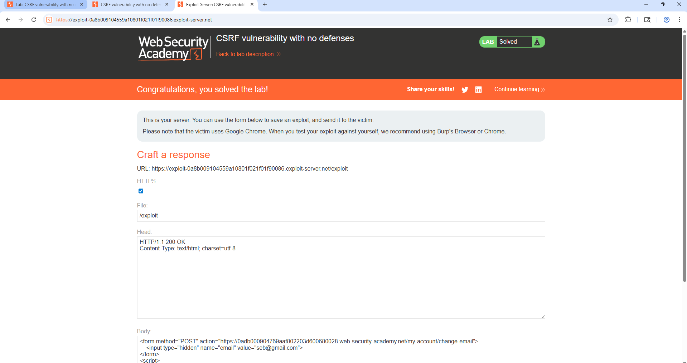
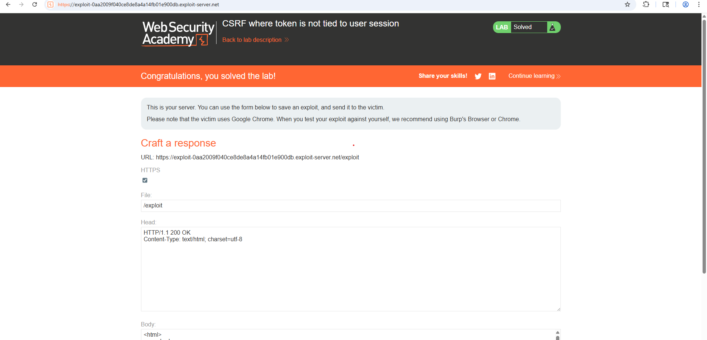

= Questions de Synthèse / LAB

**LAB 1:
**

**LAB 2:
**

**LAB 3:
**

= QUESTIONS:

#1) Expliquez avec vos propres mots pourquoi l’attaque CSRF du Lab 1 ne fonctionnerait pas si la victime s’était déconnectée du site cible juste avant de visiter la page malveillante de l’attaquant ?#

REPONSE:

__L’attaque CSRF repose sur le fait que la victime est déjà authentifiée sur le site cible au moment où elle visite la page malveillante. Cela signifie que son navigateur envoie automatiquement ses cookies de session avec la requête frauduleuse, ce qui fait croire au site que la requête est légitime. __

_Si la victime s’était déconnectée juste avant, son navigateur ne disposerait plus d’une session valide (ou les cookies ne seraient plus valides). Par conséquent, la requête envoyée par la page malveillante ne serait pas authentifiée. Le site cible considérerait alors cette requête comme non autorisée et refuserait de modifier l’adresse e-mail._

__Donc en résumé, sans session active, l’attaque CSRF ne peut pas usurper l’identité de la victime, donc elle échoue.
__

#2) Dans le Lab 2, quelle est la faille de logique algorithmique (côté serveur) qui a permis au jeton de l’attaquant d’être accepté pour valider l’action de la victime ? Comment le développeur aurait-il dû coder sa vérification ?#

REPONSE:

_La faille vient du fait que le jeton CSRF n’est pas lié à la session utilisateur côté serveur. Le serveur vérifie seulement si le jeton est valide, mais pas s’il appartient à l’utilisateur qui fait la requête. Résultat; un jeton généré pour l’attaquant peut être réutilisé pour la victime._

_Le développeur aurait dû lier chaque jeton CSRF à la session (ou à l’utilisateur) et vérifier côté serveur que le jeton reçu correspond bien à celui stocké pour cette session spécifique (et idéalement le rendre à usage unique)._

#3) (Lab 3) Lors de ce dernier laboratoire, vous avez hébergé votre page exploit-csrf.html localement (ou sur un serveur tiers) et non sur le serveur Mutillidae lui-même. Expliquez pourquoi le navigateur a tout de même accepté d’envoyer le cookie de session PHP (PHPSESSID) de l’utilisateur à Mutillidae lors de la soumission automatique du formulaire ?#

REPONSE:

